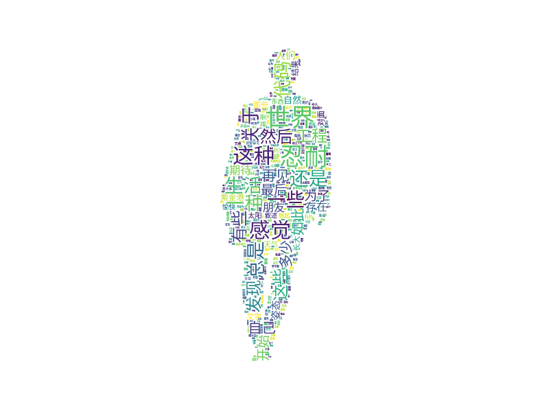
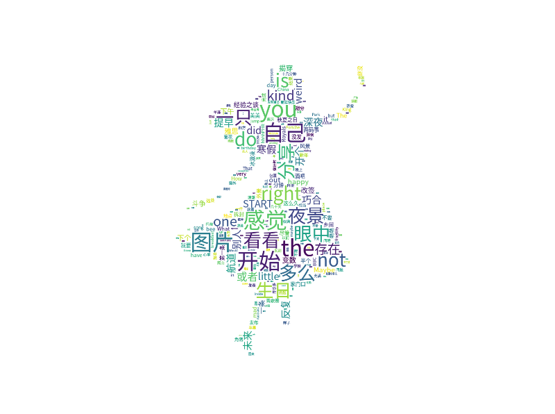

# QQSpider
```
A python crawler to grab text and pictures from qq zone and wechat moments

一个python爬虫，用来抓取QQ空间和朋友圈的文字和图片信息，并做相应的分析
```

## Dependency
```
1. python (>3.0)
2. json, hashlib, time, random, re, string (come with)
3. urllib, requests
4. selenium, geckodriver, firefox(>56.0) or Chrome(>?)
5. jieba, scipy, matplotlib, wordcloud, PIL
```

## Info

1. config.json
    > auto:  True: 自动获取cookies, 需要账号密码
    >
    > ​	   False: 手动输入cookies, 建议

    > app_id & app_key: 腾讯AI接口

2. API
    > zone.init(): 空间爬虫的初始参数设置，包括cookies在内
    >
    > zone.get_shuoshuo(class \<list\>): 爬取指定好友说说, 结果为json格式
    >
    > zone.get_photos(class \<list\>): 爬取指定好友图片并下载保存至本地

    > pyq.get_words(): 获取指定好友朋友圈的所有文字信息
    >
    > pyq.get_photos(): 获取朋友圈的所有图片并下载保存至本地

    > analyze.get_text_feel(class \<string>): 对指定好友的说说进行情感分析
    >
    > analyze.get_zone_word_cloud(class \<string>): 生成指定好友说说的词云 
    >
    > analyze.get_pyq_word_cloud(class \<string>): 生成指定好友朋友圈的词云 

3. Zone
    > cookies的获取基于selenium提供的自动化headless firefox(可能会失败, 失败请重试), 建议手动输入

    > 情感分析基于一定的正则规则进行了初步的过滤(比如各类emoji), 但是仍可能会有一些非法字符出现

    > 词云的stopwords采取了stopwords.txt中的内容

4. Wechat
    > 微信没有开放网页接口, 爬取部分基于应用内数据的导出
    
    > WeChatMomentStat: Android平台下的数据导出工具
    >
    > link: https://github.com/Chion82/WeChatMomentStat-Android

    > BlueStacks: 蓝叠安卓模拟器, 开启root权限

    > 导出的exported_sns.json替换主目录下的同名文件 

    > 朋友圈爬取照片目前只停留在个人阶段. 可以成功爬取他人的照片url, 但是这些url(可能进行了加密处理)目前还无法访问, 如果有时间会继续分析

## Usage
1. zone
```python
zone.init() # Set up "config.json"
zone.get_shuoshuo()
zone.get_photos()
analyze.get_text_feel() or analyze.get_zone_word_cloud()
```
2. pyq
```python
pyq.get_words()
pyq.get_photos()
analyze.get_pyq_word_cloud()
```

## ScreenShots (Word Cloud)

 

 

